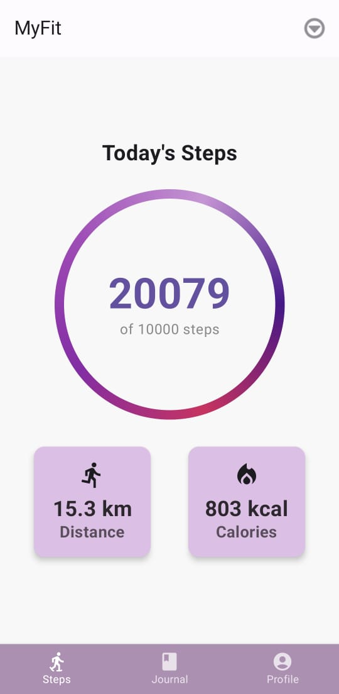
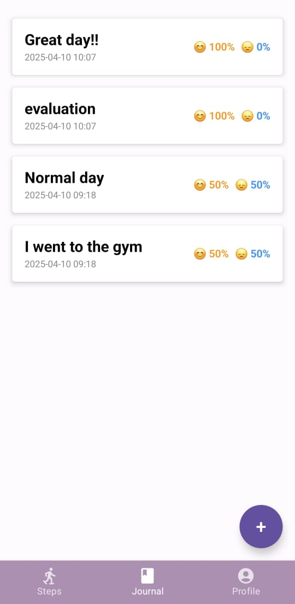
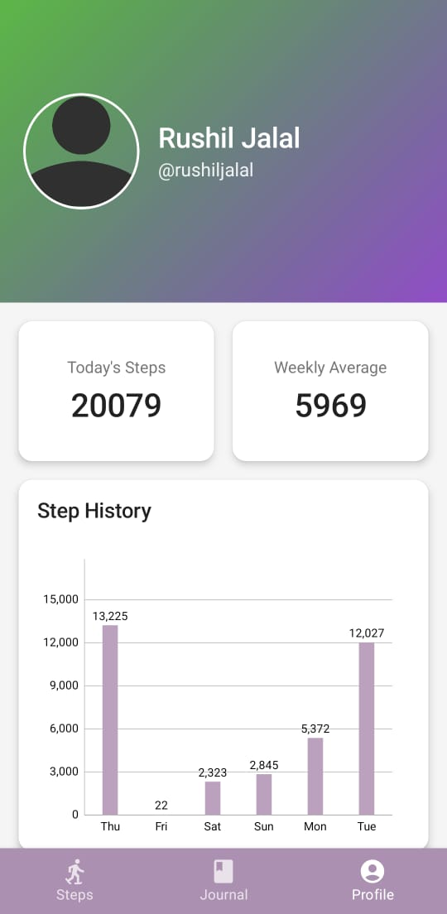

# MyFit - Physical and Mental Fitness App

MyFit is a modern Android application built with Jetpack Compose that helps users track and manage their physical and mental fitness . The app provides a beautiful and intuitive interface for monitoring steps, journal entries, and achieving fitness goals.

## Features

- Modern Material Design 3 UI with Jetpack Compose
- Steps tracking
- Journal entries with mood analysis
- Progress visualization with charts
- User profile management
- Responsive and fluid animations

## Screenshots





## Technical Stack

- **Language:** Kotlin
- **UI Framework:** Jetpack Compose
- **Architecture:** MVVM with Navigation Component
- **Key Libraries:**
  - Jetpack Compose UI
  - Material 3 Design
  - SQLite database for storing steps
  - MPAndroidChart for data visualization
  - Coil for image loading
  - DataStore for preferences
  - Navigation Compose
  - WorkManager, AlarmManager for background tasks

## Getting Started

### Prerequisites

- Android Studio
- JDK 11 or newer
- Android SDK 31 or newer

### Installation

1. Clone the repository:

```bash
git clone https://github.com/rushiljalal/MyFit.git
```

2. Open the project in Android Studio

3. Sync the project with Gradle files

4. Run the app on an emulator or physical device
